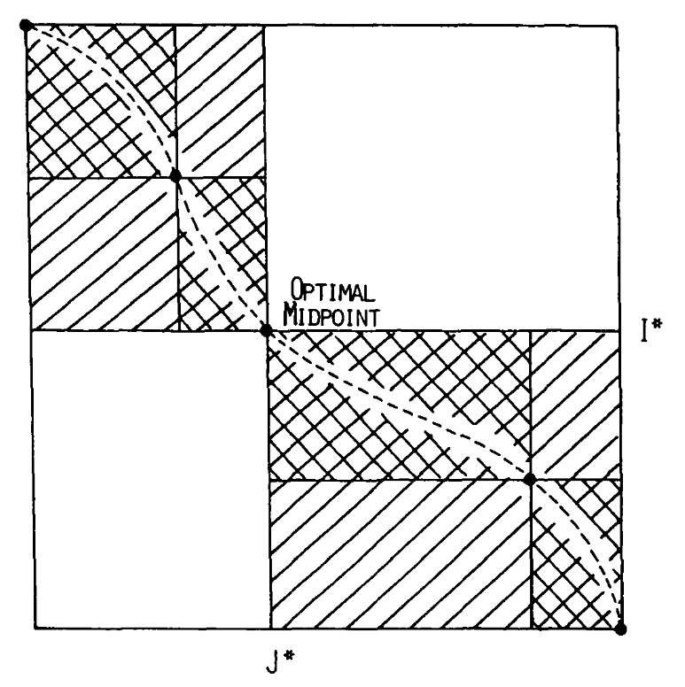

<style>
slides > slide {
  overflow-x: auto !important;
  overflow-y: auto !important;
}
</style>

<style type="text/css">
slides > slide:not(.nobackground):after {
  content: '';
}
</style>
 
```{r, setup, include=FALSE}
knitr::opts_chunk$set(eval = FALSE, fig.align = "center")
source("plots.R")
library(Rcpp)
library(purrr)
library(pryr)
library(dplyr)
library(profmem)

sourceCpp("Utils.cpp", cacheDir = getwd())
sourceCpp("NWSW.cpp", cacheDir = getwd())
sourceCpp("Hirshberg.cpp", cacheDir = getwd())

source("RUtils.R")
```
 
 

## Il problema dell'allineamento

Siano $A$ e $B$ due sequenze di lunghezza $N$ e $M$ su un alfabeto $\Sigma$, allinearle significa
trovare la edit-string $E$ (sequenza di elementi di $\sigma = \{m,i,d\}$) tale che:


* $N = |\{ i : 0<i\le|E|, E[i]=m\}| + |\{ i : 0<i\le|E|, E[i]=d\}|$
* $M = |\{ i : 0<i\le|E|, E[i]=m\}| + |\{ i : 0<i\le|E|, E[i]=i\}|$
* $E$,$A$ e $B$ massimizzano una funzione di *score* $s:(\sigma^*,\Sigma^*, \Sigma^*) \rightarrow \mathbb{R}$


Nella formulazione originale del problema la funzione di score viene calcolata secondo la seguente formula ricorsiva:

$$score(E,A,B) = \cases{0 \mbox{   if   } E=\varepsilon \\
                        g + score(E[2:],A,B[2:]) \mbox{   if   } E[1] = i \\
                        g + score(E[2:],A[2:],B) \mbox{   if   } E[1] = d \\
                        match(A[1],B[1]) + score(E[2:],A[2:],B[2:]) \mbox{   if   } E[1] = d \\
                         }$$

Con $match: (\Sigma,\Sigma) \rightarrow \mathbb{R}$ e $g\in\mathbb{R}$.
                
Intuitivamente $match$ è una funzione che associa un punteggio all'allineamento di due caratteri dell'alfabeto e $g$ indica
il costo associato all'introduzione di uno spazio nell'allineamento.

## Soluzioni con la programmazione dinamica

Dato che $g$ e $match$ sono indipendenti dal contesto, è possibile formulare una soluzione per il problema proposto 
basata anch'essa su un'unica equazione ricorsiva:


$$align(A,B) = \cases{\\ (\varepsilon,0) \mbox{   if   } (A = \varepsilon) \land (B = \varepsilon) \\
                        \mbox{let } ri = algn(A,B[2:]) \\
                        \mbox{let } rd = algn(A[2:],B) \\
                        \mbox{let } rm = algn(A[2:],B[2:]) \\
                        \mbox{let } best = \cases{i \mbox{   if   } ri(2)+g > rd(2)+g \land ri(2)+g > match(A[1],B[1])+rm(2) \\
                                               d \mbox{   if   } rd(2)+g > match(A[1],B[1])+rm(2)\\
                                               m \mbox{   otherwise   } } \\
                        (i:ri(1), g+ri(2)) \mbox{   if   } (A = \varepsilon) \lor best=i \\
                        (d:rd(1), g+rd(2)) \mbox{   if   } (B = \varepsilon) \lor best=d \\
                        (m:rm(1), match(A[1],B[1])+rm(2)) \mbox{   otherwise   } \\ 
                         \\
                         }$$
                         
Utilizzando la programmazione dinamica, Needelman e Wunsh, hanno ottenuto un algoritmo in grado di operare in 
tempo e spazio quadratici ($O(NM)$). Questo si basa due passaggi:

1. si calcolano score e mossa (tra $\{i,d,m\}$) ottimali al passo considerato per tutte le possibili coppie di suffissi di $A$ e $B$ (che sono appunto $(N+1)\cdot(M+1)$)   
2. si procede con backtracking a partire dalla posizione associata alla coppia $(A,B)$ in modo da ricostruire la edit string

## Allinementi locali e globali

La procedura indicata fin ora è detta di allineamento globale. Questo tipo di approccio consente di confrontare sequenze
simili, ma non è adeguata, ad esempio, ad individuare la presenza di sequenze piccole all'interno di altre più grandi. 
La tecnica utilizzata nell'algoritmo di Smith-Waterman invece, consente l'introduzione a costo 0 di gap in coda e all'inizio
delle sequenze.

L'algoritmo di Smith-Waterman procede esattamente come quello di Needelman-Wunsch con l'accortezza di non valutare il costo dei
gap nelle suddette condizioni. Queste possono essere facilmente visualizzate in quanto corrispondono ai "bordi" della matrice
di programmazione dinamica.

## L'algoritmo di Hirshberg

Osservando l'equazione ricorsiva indicata in precedenza si può notare come ogni passo della ricorsione faccia rifermiento
solamente a tre specifiche chiamate tra loro adiacenti nella matrice di programmazione dinamica.

Questo consente, in modo molto semplice, di ridurre lo spazio di memoria necessario per il calcolo del massimo score per un allineamento.
E' infatti sufficiente procedere per righe e memorizzarne solo le ultime due durante l'esecuzione dell'algoritmo di 
programmazione dinamica. 

Per ottenere la edit string è necessario invece procedere con un approccio ricorsivo che si basa sulla seguente proprietà:

* L'allineamento ottimale delle stringhe $(A,B)$ ha un punteggio che è dato dalla somma ottimale dei punteggi
  dei possibili allineamenti di $A$ con sottostringhe di $B[:M/2]$ e di $A^{-1}$ con sottostringhe di  $B[(M/2)+1:]^{-1}$
  
Questa proprietà rimane valida per l'indipendenza dalla posizione per quanto riguarda la funzione di costo di match e gap e 
per la simmetricità del problema dell'allineamento.



La posizione individuata dalla cella relativa alla posizione ottimale, divide la matrice di programmazione dinamica in 
quattro diversi quadaranti. L'algoritmo procede ricorrendo con sui soli due contenenti le posizioni $(0,0)$ e $(N,M)$, e 
quindi sulle relative sottostringhe. 
Il caso base in cui la matrice abbia altezza uno o minore è risolto con l'algoritmo direttamente
di Needelman-Wunsch. Le edit string ottenute con queste procedure vengono unite e descrivono un allineamento
ottimo grazie alla proprietà citata in precedenza.  

## Complessità del backtracking

L'attività di backtracking richede di eseguire un numero logaritmico (rispetto a $M$) di chiamate ricorsive e quindi 
di ricalcolo dell'allinemento su matrici di dimensione via via dimezzata. Facendo i conti la complessità totale risulta essere quindi 
(nell'assunzione che siano necessarie $NM$ operazioni per l'allineamento, che in caso sono suddivise sui due quadranti):

$$ \sum_{i=1}^{log(M)}{ N(M/2^i) } = NM\sum_{i=1}^{log(M)}{ (1/2^i) } = NM$$

Il che quindi permette di mantenere la complessità computazionale invariata rispetto all'algoritmo di Needelman-Wunsch (ossia $O(NM)$).
La complessità spaziale invece è ridotta a $O(N+M)$ in quato la matrice di programmazione dinamica viene calcolata in spazio ridotto come
spiegato. 

## Considerazioni sulla correttezza

La correttezza dell'algoritmo segue in modo diretto da quella di Needelman-Wunsch e dalla prorprietà indicata in precedenza.

# Implementazione

## Needelman-Wunsh e Smith-Waterman

```
// algoritmo di Needelman-Wunsch e Smith-Waterson
std::vector<edit_string>* alignment_naive( vector_reader<int>* nseq1, vector_reader<int>* nseq2, bool is_global,
                                           std::string* seq_alphabet,
                                           NumericMatrix score_matrix,
                                           double gap_cost){
    
    std::vector<std::vector<double>*>* alignment_matrix =
        make_matrix(nseq2->size()+1,nseq1->size()+1, 0.);

    std::vector<std::vector<edit_string>*>* backtracking_matrix =
        make_matrix(nseq2->size()+1,nseq1->size()+1, edit_string::deletion);
    
    
    /* init */
    if(is_global == 1 || !is_on_borders(0,nseq1)){
        for(int i=1; i<nrow(alignment_matrix); i++)
            alignment_matrix->at(i)->at(0) = a(alignment_matrix, i-1, 0) + gap_cost;
    }
    if(is_global == 1 || !is_on_borders(0,nseq2)){
        for(int j=1; j<ncol(alignment_matrix); j++)
            alignment_matrix->at(0)->at(j) = a(alignment_matrix, 0, j-1) + gap_cost;
    }
    
    // print_matrix(alignment_matrix);

    init_bktr_borders(backtracking_matrix);
     
    // PD
    for(int i=1; i<nrow(alignment_matrix); i++){
        for(int j=1; j<ncol(alignment_matrix); j++){
            int el1 = nseq1->at(j-1);
            int el2 = nseq2->at(i-1);
            double up   = a(alignment_matrix, i-1, j) + 
                ((is_global==0 && (is_on_borders_end(j-1,nseq1)))?0:gap_cost);
            // l'inserimento locale non deve penalizzare i gap in coda
            double left = a(alignment_matrix, i, j-1) + 
                ((is_global==0 && (is_on_borders_end(i-1,nseq2)))?0:gap_cost);
            // l'inserimento locale non deve penalizzare i gap in coda
            double diag = a(alignment_matrix, i-1, j-1) + score_matrix(el1,el2);
            if( (up > left) && (up > diag)){ //up
                alignment_matrix->at(i)->at(j) = up;
                backtracking_matrix->at(i)->at(j) = edit_string::insertion;
            }else if(left > diag){ //left
                alignment_matrix->at(i)->at(j) = left;
                backtracking_matrix->at(i)->at(j) = edit_string::deletion;
            }else{ //diag
                alignment_matrix->at(i)->at(j) = diag;
                backtracking_matrix->at(i)->at(j) = edit_string::match;
            }
        }
    }

    
    // BACKTRACKING
    std::vector<edit_string>* out = new std::vector<edit_string>();
    int i = nrow(alignment_matrix)-1;
    int j = ncol(alignment_matrix)-1;

    
    while(i>0 || j>0){
        if(a(backtracking_matrix,i,j) == edit_string::insertion){ //up
            out->push_back(edit_string::insertion);
            i--;
        }else if(a(backtracking_matrix,i,j) == edit_string::deletion){ //left
            out->push_back(edit_string::deletion);
            j--; 
        }else{ //diag
            out->push_back(edit_string::match);
            i--;
            j--;
        }
    }
    
    // l'output è stato inserito dalla coda alla testa   
    std::reverse(out->begin(),out->end());  
    
    // cleanup 
    del(alignment_matrix);
    del(backtracking_matrix);
    
    return out;

}
```

## Hirshberg 

```
// calcolo dello score secondo gli algoritmi di NW/SW in spazio lineare
// il nome è preso dal paper di Hishberg
ALGB_OUT* algorithm_B(
        vector_reader<int>* nseq1, vector_reader<int>* nseq2, bool is_global,
        std::string* seq_alphabet,
        NumericMatrix score_matrix,
        double gap_cost){
    
    std::vector<double>* line1 = make_vector(nseq1->size()+1, 0.);
    std::vector<double>* line2 = make_vector(nseq1->size()+1, 0.);
    
    std::vector<double>* upper_border = make_vector(nseq1->size()+1, 0.);
    std::vector<double>* left_border = make_vector(nseq2->size()+1, 0.);
    
    std::vector<edit_string>* bktr1 = make_vector(nseq1->size()+1, edit_string::insertion);
    std::vector<edit_string>* bktr2 = make_vector(nseq1->size()+1, edit_string::insertion);
    
    // precalcolo dei bordi della matrice (per semplicità implementativa)
    for(int i = 0; i<upper_border->size(); i++){
        if(is_global == 0 && is_on_borders(0,nseq2)){
            upper_border->at(i) = 0;
        } else {
            upper_border->at(i) = gap_cost*i;    
        }
        line1->at(i) = upper_border->at(i);
        bktr1->at(i) = edit_string::deletion;
    }
    
    for(int i = 0; i<left_border->size(); i++){
        if(is_global == 0 && is_on_borders(0,nseq1)){
            left_border->at(i) = 0;
        } else { 
            left_border->at(i) = gap_cost*i;    
        }
    }
    
    // algoritmo di programmazione dinamica
    for(int depth = 1; depth<=nseq2->size(); depth++){
        
        line2->at(0) = left_border->at(depth);
        bktr2->at(0) = edit_string::insertion;
        
        for(int i=1; i<line1->size(); i++){
        
            int el1 = nseq1->at(i-1);
            int el2 = nseq2->at(depth-1);
            
            // gestione delle diverse direzioni
            double up = 0.;
            double left = 0.;
            double diag = 0.;
            
            if(is_global == 0 && is_on_borders_end(i-1,nseq1)){
                up = line1->at(i);
            }else{
                up = line1->at(i) + gap_cost;
            }
            
            if(is_global == 0 && is_on_borders_end(depth-1,nseq2)){
                left = line2->at(i-1);
            }else{
                left = line2->at(i-1) + gap_cost;
            }
            
            diag = line1->at(i-1) + score_matrix(el1,el2);
            
            if(up > left && up > diag){
                line2->at(i) = up;
                bktr2->at(i) = edit_string::insertion;
            }else if(left>diag){
                line2->at(i) = left;
                bktr2->at(i) = edit_string::deletion;
            }else{
                line2->at(i) = diag;
                bktr2->at(i) = edit_string::match;
            }
        }
        
        // passaggio alla linea successiva della matrice
        // tramite swap
        std::vector<double>* swap = line1;
        line1 = line2;
        line2 = swap;
        
        std::vector<edit_string>* swapbktr = bktr1;
        bktr1 = bktr2;
        bktr2 = swapbktr;
        
        
    }
    
    ALGB_OUT* out = new ALGB_OUT;
    out->line = line1;
    out->bktr = bktr1;
    out->score = line1->at(line1->size()-1);
    // cleanup bordi
    delete(line2);
    delete(bktr2);
    delete(upper_border);
    delete(left_border);
    return out;
     
} 

// esecuzione ricorsiva dell'algoritmo di Hirshberg
std::vector<edit_string>* alignment_Hirshberg( 
        vector_reader<int>* nseq1, vector_reader<int>* nseq2, bool is_global,
        std::string* seq_alphabet,
        NumericMatrix score_matrix,
        double gap_cost){
    
    int l1 = nseq1->size();
    int l2 = nseq2->size();
    
    // casi base
    if(l1 == 0 && l2 == 0){
        return new std::vector<edit_string>();
    }
    if(l1 <= 1 || l2 <= 1){
        return alignment_naive(nseq1, nseq2, is_global,
                               seq_alphabet, score_matrix, gap_cost); 
    }
    
    // calcolo degli score sulle due metà
    int split = (int) ((l2-1)/2);
    
    vector_reader<int>* nseq2_low = new vector_reader<int>(nseq2,0,split);
    vector_reader<int>* nseq2_hi = new vector_reader<int>(nseq2,split+1,nseq2->size()-1);
    
    ALGB_OUT* res_low = algorithm_B(nseq1,nseq2_low,is_global,
                                   seq_alphabet, score_matrix, gap_cost);
    
    nseq1->reverse();
    nseq2_hi->reverse();
    
    ALGB_OUT* res_hi = algorithm_B(nseq1,nseq2_hi,is_global,
                                  seq_alphabet, score_matrix, gap_cost);
    
    nseq1->reverse(); // reset 
    
    // cleanup indici ausiliari
    delete(nseq2_hi);
    delete(nseq2_low);
    
    // join degli allineamenti
    int max_pos = 0;
    int max = INT_MIN;
    
    vector_reader<double>* ans_hi = new vector_reader<double>(res_hi->line,0,res_hi->line->size()-1);
    vector_reader<double>* ans_low = new vector_reader<double>(res_low->line,0,res_low->line->size()-1);
    ans_hi->reverse();
    
    for(int i=0; i<ans_hi->size(); i++){
        int val = ans_low->at(i) + ans_hi->at(i);
        if(val > max){
            max_pos = i-1;
            max = val;
        }    
    }
    
    // cleanup elementi per il join
    delete(ans_hi);
    delete(ans_low);
    delete(res_hi->bktr);
    delete(res_hi->line);
    delete(res_low->bktr);
    delete(res_low->line);
    delete(res_hi);
    delete(res_low);
    
    // ricorsione
    std::vector<edit_string>* rec1 = alignment_Hirshberg(
        new vector_reader<int>(nseq1,0,max_pos),
        new vector_reader<int>(nseq2,0,split),
        is_global,
        seq_alphabet,
        score_matrix,
        gap_cost
    );
    
    std::vector<edit_string>* rec2 = alignment_Hirshberg(
        new vector_reader<int>(nseq1,max_pos+1,nseq1->size()-1),
        new vector_reader<int>(nseq2,split+1,nseq2->size()-1),
        is_global,
        seq_alphabet,
        score_matrix,
        gap_cost
    );

    // concatena i due risultati
    for(int i=0; i<rec2->size();i++)
        rec1->push_back(rec2->at(i));
    
    // cleanup finale
    delete(rec2);
    // vanno bene qui per come operano le chiamate ricorsive
    delete(nseq1);
    delete(nseq2);
    
    return rec1;
    
}
```

## vector_readers e allineamento locale 

Per gestire l'allineamento locale e le inversioni a costo costante delle stringe si è creato l'oggetto `vecor_reader`:

```
template <class T> class vector_reader
{
public:
    vector_reader(std::vector<T>*, int, int);
    vector_reader(vector_reader<T>*, int, int);
    int true_position(int);
    bool is_true_last(int pos);
    bool is_true_first(int pos);
    T& at(int);
    int size();
    int offset(int pos);
    void reverse();
    std::vector<T>* get_buffer();
    bool is_rev();
private:
    int begin,end;
    std::vector<T>* buffer;
    bool is_reverse;
};
```

Questo opera semplicemente tramite puntatori e permette di astrarre rispetto alla
direzione di lettura delle sequenze da allineare.

## Complessità sperimentale

Spaziale:

```{r, eval=TRUE, warning=FALSE, message = FALSE}
space.plot
```


Temporale:

```{r, warning=FALSE, message = FALSE, eval=TRUE}
time.plot
```

Temporale (scala logaritmica):

```{r, warning=FALSE, message = FALSE, eval=TRUE}
time.plot.log
```

## Codice sorgente

Il codice sorgente completo è disponibile all indirizzo 

[https://github.com/redsnic/HirshbergRcpp]("https://github.com/redsnic/HirshbergRcpp")

# Usare funzioni di gap più complesse

## L'algoritmo di Gotoh

In questo caso lo scopo è usare le funzioni di gap a costo affine, ossia del tipo:

$$ g(l) = a + (l-1)b$$

Dove $a,b\in\mathbb{R}$ e $l\in \mathbb{N}$ è la lunghezza del gap. Solitamente $b<a$ in quanto, per applicazioni biologiche, è realistico credere che si possano più facilmente formare gap lunghi in un unico evento anzichè molti gap brevi.

Gotoh permette gap con questi costi semplicemente modificando l'algoritmo di Needelman-Wunsch aggiungendo
due possibili alternative alla funzione ricorsiva:

* Estendere il miglior gap esistente (ottenuto con delezioni) per la posizione con una delezione
* Estendere il miglior gap esistente (ottenuto con inserzioni) per la posizione con una inserzione

Queste due opzioni dipendono solamente dalle posizioni superiore e sinistra rispetto alla cella 
considerata della matrice di programmazione dinamica. E' possibile quindi considerare il miglior
gap da estendere indicato al passo precedente ed estenderlo, oppure considerare l'ultimo gap generato
ed estendere quello, se migliore in punteggio. 

## L'algoritmo di Myers e Miller

Come già indicato nell'articolo originale di Gotoh, le informazioni necessarie per seguire il suo metodo
possono essere ristrette in spazio ad una coppia di vettori similmente a come accade per la matrice di 
programmazione dinamica nell'algoritmo di Hirshberg. Myers e Miller riprendono quindi l'algoritmo di 
Gotoh e di Hirshberg e li fondono, consentendo quindi l'allineamento in spazio lineare, tempo quadratico 
e con funzioni di gap affini.

In questo contesto è di massima importanza verificare che, nella procedura di unione dei costi dati dalle
ricorsioni sulle sequenze invertita e non, si tenga traccia della possibilità che un gap stia venendo 
esteso. In quel caso bisogna correggere il problema considerando anche, già a priori, che sia possibile
estendere un gap esistente "virtuale" e valutarne la possibilità durante il calcolo della somma degli score.

## Conclusione

Utilizzare algoritmi come quello di Hirshberg consente analisi su sequenze di dimensione rilevante
anche su calcolatori dotati di un basso quantitativo di memoria. Nello specifico, come si può notare
dai grafici relativi all'implementazione presentata, è possibile ad esempio allineare in modo esatto
interi genomi virali, senza dover ricorrere a tecniche approssimate e su calcolatori di dimensioni e
potenza modesta, come un normale PC. 

```{r, warning=FALSE, message = FALSE, eval=TRUE}
# Score per l'allineamento dei genomi di COVID cinese e statunitense

seq1 <- read_fasta("COVID_CHINA.fasta")
seq2 <- read_fasta("COVID_USA.fasta")

a_HIRSH <- align_Hirshberg(seq1, seq2, FALSE,
           nucleotides.order,
           DNA.base.matrix,
           -1)

score_alignment(seq1, seq2, FALSE,
           nucleotides.order,
           DNA.base.matrix,
           -1, a_HIRSH)
```


## Bibliografia

* A general method applicable to the search for similarities in the amino acid sequence of two proteins 
S B Needleman, C D Wunsch PMID: 5420325 DOI: 10.1016/0022-2836(70)90057-4 
* Identification of common molecular subsequences, T F Smith, M S Waterman, PMID: 7265238 DOI: 10.1016/0022-2836(81)90087-5
* A linear space algorithm for computing maximal common subsequences, D. S. Hirschberg, Communications of the ACM June 1975 https://doi.org/10.1145/360825.360861
* An improved algorithm for matching biological sequences. J Mol Biol. 1982 Dec 15;162(3):705-8. doi:10.1016/0022-2836(82)90398-9.
* Eugene W. Myers, Webb Miller, Optimal alignments in linear space, Bioinformatics, Volume 4, Issue 1, March 1988, Pages 11–17, https://doi.org/10.1093/bioinformatics/4.1.11


